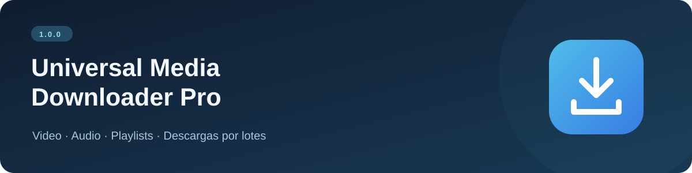

<p align="center"></p>

<p align="center">
  <a href="https://github.com/Sergio5331/Universal-Media-Downloader/releases/tag/v1.0.0"><strong>Descargar el instalador</strong></a>
  &nbsp; · &nbsp;
  <a href="https://github.com/Sergio5331/Universal-Media-Downloader/issues/new?template=error.yml">Reportar un problema</a>
</p>

**Universal Media Downloader Pro** es una aplicación de escritorio para descargar video y extraer audio desde enlaces compatibles con su motor yt-dlp. Reúne descargas individuales, colas por lotes y opciones para playlists en una interfaz en español.

> **Versión 1.0.0.** La disponibilidad de cada descarga depende del sitio de origen, del enlace y del motor de descarga.

## Funciones

| Función | Descripción |
| :--- | :--- |
| Descarga individual | Analiza un enlace y muestra el título, la miniatura y las calidades disponibles |
| Cola por lotes | Procesa varios enlaces, uno por línea |
| Playlists | Permite activar la descarga de listas completas y organizarlas en carpetas |
| Video | Selección de calidad y combinación de video/audio con salida MP4 cuando los formatos lo permiten |
| Audio MP3 | Conversión a 128, 192 o 320 kbps |
| Carátulas y etiquetas | Opción para incorporar miniatura y metadatos al MP3 cuando estén disponibles |
| Motor actualizable | Comprobación al iniciar y botón para actualizar yt-dlp |
| Destino | Selección de la carpeta donde se guardarán los archivos |

## Descargar e instalar

1. Abre [Universal Media Downloader Pro 1.0.0](https://github.com/Sergio5331/Universal-Media-Downloader/releases/tag/v1.0.0).
2. En **Assets**, descarga **Instalador_UniversalDownloader_v1.0.exe**.
3. Ejecuta el instalador y sigue el asistente en español. Puede solicitar permisos de administrador.
4. Si quieres, activa la opción de crear un acceso directo en el escritorio.
5. Abre **Universal Media Downloader** desde el menú Inicio o el acceso directo.

La distribución es para **Windows de 64 bits**. El ejecutable está empaquetado con Python y FFmpeg. No necesitas instalar Python por separado para abrirlo. Se requiere conexión a Internet para descargar contenido y actualizar el motor.

## Uso básico

**Un enlace:** pégalo en *Descarga Individual*, pulsa **Buscar**, elige video o audio, selecciona la calidad y la carpeta, y pulsa **Iniciar Descarga**.

**Varios enlaces:** abre la pestaña de lotes y pega un enlace por línea. La aplicación los procesa en una cola.

Las cookies del navegador son opcionales y están desactivadas inicialmente. Puedes elegir un navegador si el sitio necesita una sesión disponible en tu equipo.

## Notas de funcionamiento

- La compatibilidad con sitios puede cambiar. Actualizar el motor puede ayudar, pero no garantiza que todos los enlaces funcionen.
- El mensaje final de la cola indica que terminó el procesamiento; en esta versión no garantiza que todos los archivos se hayan descargado. Comprueba la carpeta de destino.
- La distribución utiliza una firma de desarrollo con certificado autofirmado. Windows puede mostrar un aviso porque el certificado no pertenece a un editor validado por una autoridad certificadora. Consulta la [información de firma](docs/SIGNING.md).
- El instalador incorpora la licencia GPLv3. No se ha realizado una prueba de descarga de cada plataforma para esta publicación.

## Ayuda y comentarios

[Reporta un error](https://github.com/Sergio5331/Universal-Media-Downloader/issues/new?template=error.yml) indicando la versión de Windows, la versión del motor que aparece en la aplicación y los pasos para reproducirlo.

## Código fuente y licencia

El código fuente de la aplicación está disponible en este repositorio bajo la **GNU General Public License versión 3 (GPL-3.0-only)**. Puedes usarlo, estudiarlo, modificarlo y redistribuirlo conforme a [LICENSE](LICENSE). Al distribuir versiones modificadas, debes proporcionar el código fuente correspondiente bajo la misma licencia. La aplicación se ofrece sin garantía.

Las dependencias y las herramientas externas, incluido FFmpeg, conservan sus propias licencias. La licencia de este proyecto no sustituye las de esos componentes.

## Ejecutar desde el código fuente (Windows)

Necesitas **Python 3.11 o superior**, con Tkinter, y **FFmpeg**. Obtén FFmpeg y FFprobe desde una distribución para Windows enlazada en [ffmpeg.org](https://ffmpeg.org/download.html) y coloca `ffmpeg.exe` y `ffprobe.exe` en la raíz del proyecto, junto a `app_descargador.py`. Estos binarios no están incluidos en el repositorio.

En PowerShell:

```powershell
git clone https://github.com/Sergio5331/Universal-Media-Downloader.git
cd Universal-Media-Downloader
py -3 -m venv .venv
.\.venv\Scripts\python.exe -m pip install -r requirements.txt
.\.venv\Scripts\python.exe app_descargador.py
```

El motor actualizable se guarda en `%LOCALAPPDATA%\UniversalDownloader\motor`. La aplicación consulta PyPI al iniciar y permite actualizarlo con el botón **Actualizar motor**.

## Compilar el ejecutable y el instalador

Con el entorno anterior y los binarios de FFmpeg en la raíz:

```powershell
.\.venv\Scripts\python.exe -m pip install -r requirements-dev.txt
.\.venv\Scripts\python.exe -m PyInstaller --clean --noconfirm app_descargador.spec
```

El ejecutable se genera en `dist\app_descargador.exe`. Para crear el instalador, instala [Inno Setup](https://jrsoftware.org/isinfo.php), abre `instalador.iss` y compílalo. El resultado aparece en `dist_instalador`. El instalador muestra la licencia GPLv3.

Si redistribuyes un ejecutable, proporciona también su código fuente correspondiente, los archivos de compilación y las licencias aplicables a los componentes incluidos. Publica los cambios de código que hayas realizado, y no solo un enlace a una versión anterior del proyecto.

## Firma de desarrollo

El mantenedor firma localmente la aplicación y el instalador con un certificado autofirmado. El certificado público y su huella están disponibles en [`certificates/`](certificates/). La clave privada no se publica. Esta firma no garantiza que desaparezca el aviso de SmartScreen. Consulta [cómo compilar, firmar y verificar una descarga](docs/SIGNING.md).

## Contribuir

Abre un issue para describir una mejora o envía un pull request con tus cambios. Explica cómo verificaste el comportamiento en Windows. Las contribuciones a este proyecto se distribuyen bajo GPL-3.0-only.

---

Desarrollado por [Sergio](https://github.com/Sergio5331). También puedes conocer [OctaStudio](https://github.com/Sergio5331/OctaStudio), su editor de video y audio para Windows.
